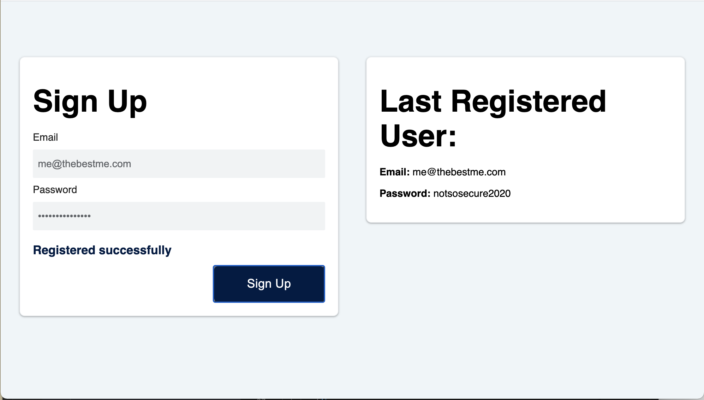

# 🏗️ Implement Client-Side Storage for Sign-Up Form Using localStorage

Work with a partner to implement the following user story:

- As a developer, I want to save the user's email and password to client-side storage and render the last submission to the page.

## Acceptance Criteria

- It's done when Last Registered User displays the last email and password saved using `localStorage`, if it exists.

- It's done when, once the `signUpButton` is clicked, the email and password entered into the text boxes is saved using `localStorage`.

- It's done when the information under Last Registered User is updated to reflect the data stored using `localStorage`.

## Assets

The following image demonstrates the web application's appearance and functionality:

---

## 💡 Hints

What methods do we use with `localStorage` to get and set items?

## 🏆 Bonus

If you have completed this activity, work through the following challenge with your partner to further your knowledge:

- Does data stored using `localStorage` have an expiration date? What happens when the browser is closed?

Use [Google](https://www.google.com) or another search engine to research this.

---

© 2021 Trilogy Education Services, LLC, a 2U, Inc. brand. Confidential and Proprietary. All Rights Reserved.
